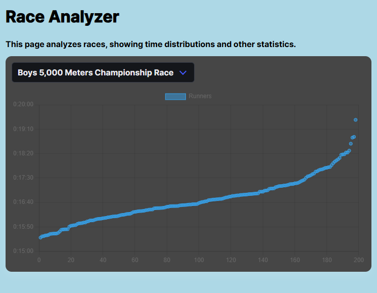
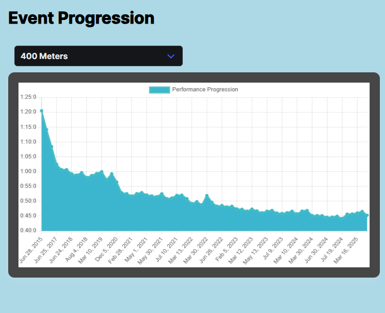
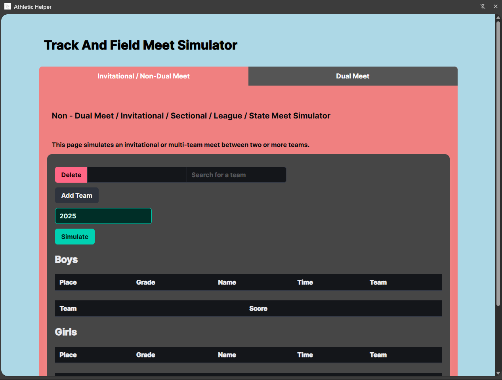
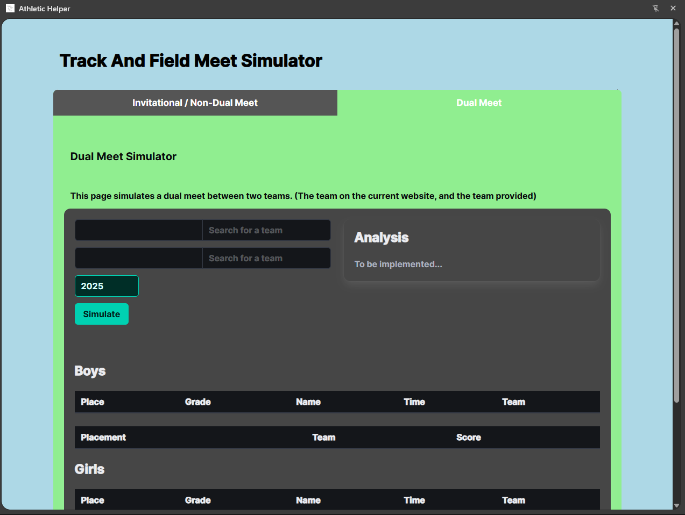
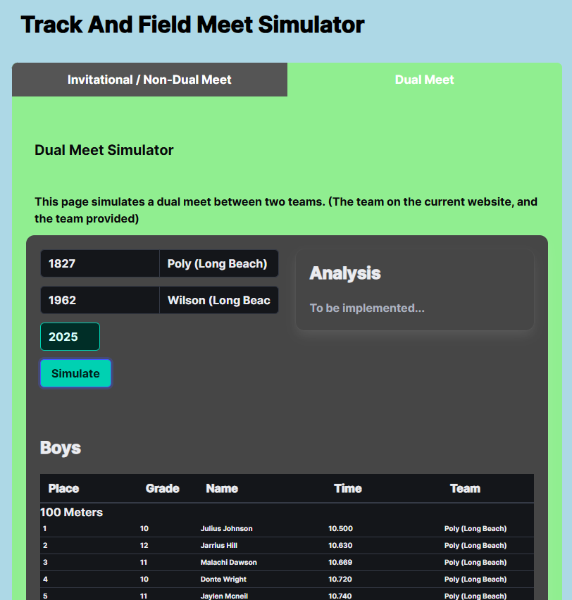

<h1>Athletic Helper</h1>
<h3>A Chrome Extension to better analyze athletic performances</h3>
<blockquote>Now available in the <a href="https://chromewebstore.google.com/detail/athletic-helper/gdnmapolllodbicoalbfpainmldmabek">Chrome Web Store</a></blockquote>

 

As a Track and Cross Country athlete, I wanted a free and easy way to simulate meets to help our team gain more insight on what we'd be facing. This extension aims to help coaches and athletes alike do exactly that

## Installation

### Via the Chrome Web Store

Go to [the Athletic Helper listing on the Web Store](https://chromewebstore.google.com/detail/athletic-helper/gdnmapolllodbicoalbfpainmldmabek) and click Add Extension.

### Manually
- Download a zip of the repo and unzip it on your computer.
- **Open [the extensions page](chrome://extensions)** in your browser: `chrome://extensions`.
- If you did not do it already, **toggle the "developer mode"**. This is usually a toggle button at the top right of the extensions page.
- Click the button **_load unpacked extension_**.
- In the window that pops up, **select the folder that contains this minimal extension**, then **click _ok_**.

## Usage

Navigate to different pages on [athletic.net](https://athletic.net) (including team, meet, and athlete), and click the extension to open the sidebar.

## Examples

#### Race Simulation

#### Progression Analysis

### Meet Analysis 

#### Invitational Analysis

#### Dual Meet Analysis

## Todo

❎ - Collection of Meets to aggregate together
✅ - Filtering Hypothetical Results (By Grade) to Predict Future Season Results

## Acknowledgements

This project is a fork of the SimGus/chrome-extension-v3-starter.
