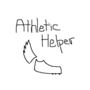

    
    <h1>Athletic Helper</h1>
    <h3>A Chrome Extension to better analyze athletic performances</h3>

As a Track and Cross Country athlete, I wanted a free and easy way to simulate meets to help our team gain more insight on what we'd be facing. This extension aims to help coaches and athletes alike do exactly that

## Installation
- Download a zip of the repo and unzip it on your computer.
- **Open [the extensions page](chrome://extensions)** in your browser: `chrome://extensions`.
- If you did not do it already, **toggle the "developer mode"**. This is usually a toggle button at the top right of the extensions page.
- Click the button **_load unpacked extension_**.
- In the window that pops up, **select the folder that contains this minimal extension**, then **click _ok_**.

## Usage

## Acknowledgements
This project is a fork of the SimGus/chrome-extension-v3-starter.

